<!-- Generated by scripts/build_readme.py; edit characters.json and regenerate. -->

# Awesome Italian Brainrot [](https://awesome.re)

Italian brainrot characters, images and audio.

**68 characters · 31 with audio** · 🔊 Audio · 🔗 Fusion

[Characters](#characters) · [Audio](#audio) · [Other spellings](#other-spellings) · [Download](#download) · [Contribute](#contributing)

## Characters

[B](#b) · [C](#c) · [E](#e) · [F](#f) · [G](#g) · [I](#i) · [L](#l) · [M](#m) · [O](#o) · [P](#p) · [R](#r) · [S](#s) · [T](#t) · [U](#u) · [Z](#z)

### B

<table>
<tr><td align="center" valign="top" width="33%"><a href="characters/ballerina-cappuccina"></a><br><a href="characters/ballerina-cappuccina"><b>Ballerina Cappuccina</b></a><br><sub>🔊 </sub></td><td align="center" valign="top" width="33%"><a href="characters/ballerino-lololo"></a><br><a href="characters/ballerino-lololo"><b>Ballerino Lololo</b></a><br><sub></sub></td><td align="center" valign="top" width="33%"><a href="characters/bananita-dolfinita"></a><br><a href="characters/bananita-dolfinita"><b>Bananita Dolfinita</b></a><br><sub></sub></td></tr>
<tr><td align="center" valign="top" width="33%"><a href="characters/bluberini-octopusini">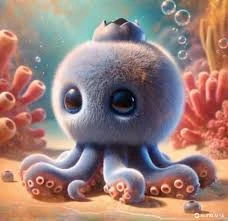</a><br><a href="characters/bluberini-octopusini"><b>Bluberini Octopusini</b></a><br><sub></sub></td><td align="center" valign="top" width="33%"><a href="characters/bobrini-cocococini">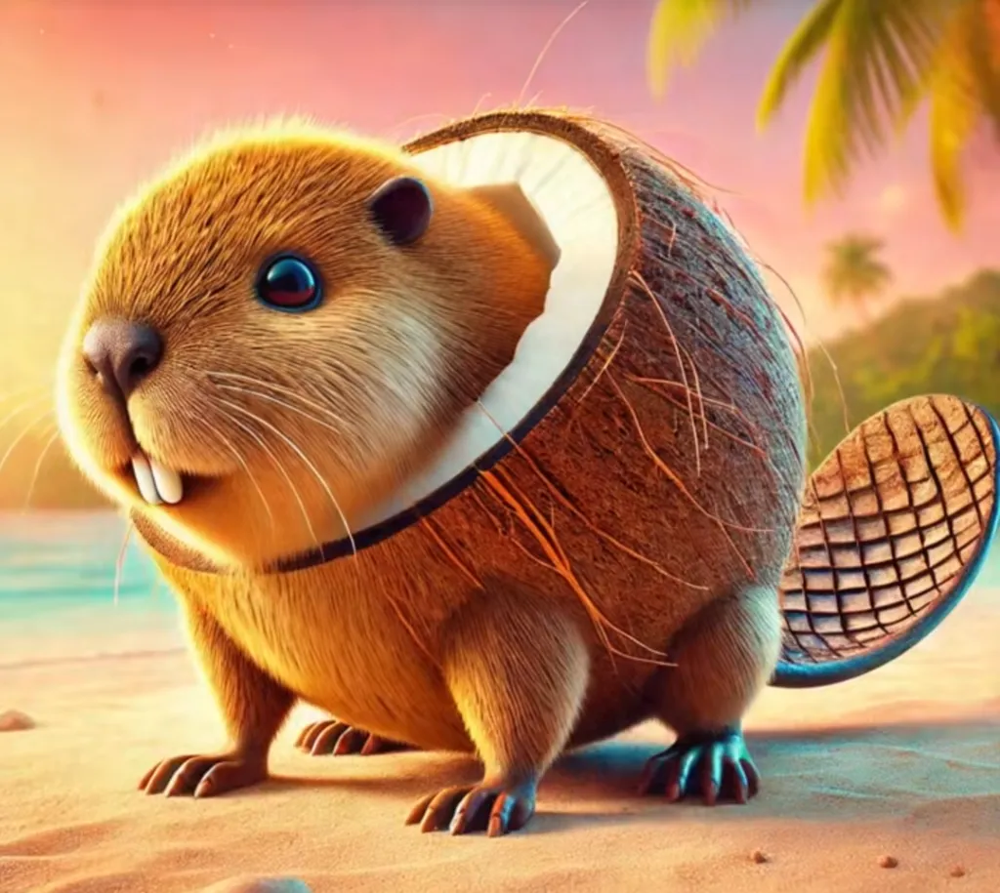</a><br><a href="characters/bobrini-cocococini"><b>Bobrini Cocococini</b></a><br><sub>🔊 </sub></td><td align="center" valign="top" width="33%"><a href="characters/bobrito-bandito"></a><br><a href="characters/bobrito-bandito"><b>Bobrito Bandito</b></a><br><sub>🔊 </sub></td></tr>
<tr><td align="center" valign="top" width="33%"><a href="characters/bombardiro-crocodilo">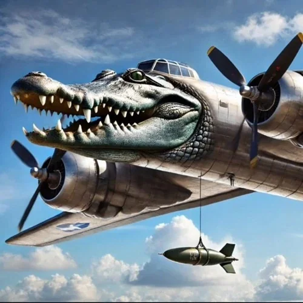</a><br><a href="characters/bombardiro-crocodilo"><b>Bombardiro Crocodilo</b></a><br><sub>🔊 </sub></td><td align="center" valign="top" width="33%"><a href="characters/bombombini-gusini">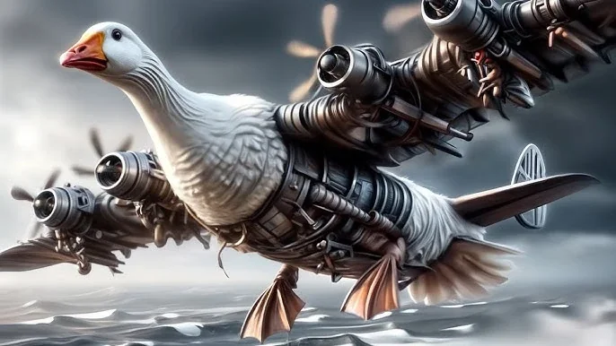</a><br><a href="characters/bombombini-gusini"><b>Bombombini Gusini</b></a><br><sub>🔊 </sub></td><td align="center" valign="top" width="33%"><a href="characters/boneca-ambalabu">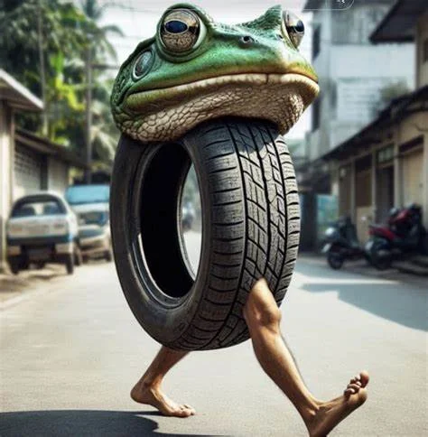</a><br><a href="characters/boneca-ambalabu"><b>Boneca Ambalabu</b></a><br><sub>🔊 </sub></td></tr>
<tr><td align="center" valign="top" width="33%"><a href="characters/brr-brr-patapim"></a><br><a href="characters/brr-brr-patapim"><b>Brr Brr Patapim</b></a><br><sub>🔊 </sub></td><td align="center" valign="top" width="33%"><a href="characters/brri-brri-bicus-dicus-bombicus"></a><br><a href="characters/brri-brri-bicus-dicus-bombicus"><b>Brri Brri Bicus Dicus Bombicus</b></a><br><sub>🔊 </sub></td><td align="center" valign="top" width="33%"><a href="characters/bulbito-bandito-traktorito">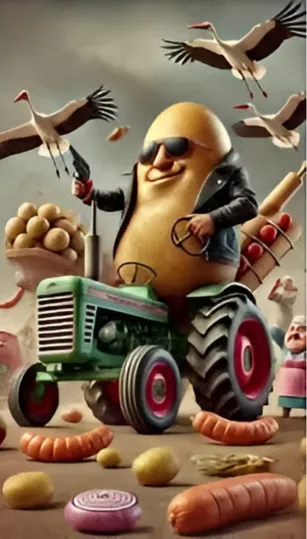</a><br><a href="characters/bulbito-bandito-traktorito"><b>Bulbito Bandito Traktorito</b></a><br><sub>🔊 </sub></td></tr>
<tr><td align="center" valign="top" width="33%"><a href="characters/burbaloni-luliloli">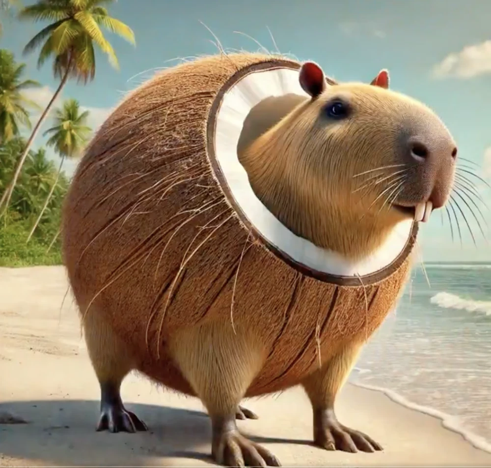</a><br><a href="characters/burbaloni-luliloli"><b>Burbaloni Luliloli</b></a><br><sub>🔊 </sub></td></tr>
</table>

### C

<table>
<tr><td align="center" valign="top" width="33%"><a href="characters/cappuccino-assassino">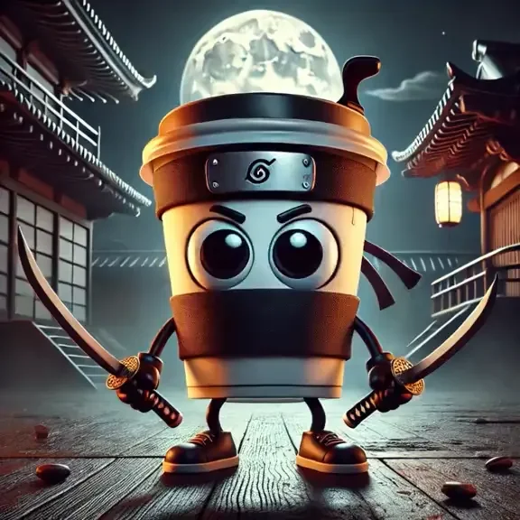</a><br><a href="characters/cappuccino-assassino"><b>Cappuccino Assassino</b></a><br><sub>🔊 </sub></td><td align="center" valign="top" width="33%"><a href="characters/chimpansini-capuchini">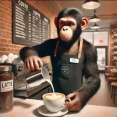</a><br><a href="characters/chimpansini-capuchini"><b>Chimpansini Capuchini</b></a><br><sub></sub></td><td align="center" valign="top" width="33%"><a href="characters/chimpanzini-bananini">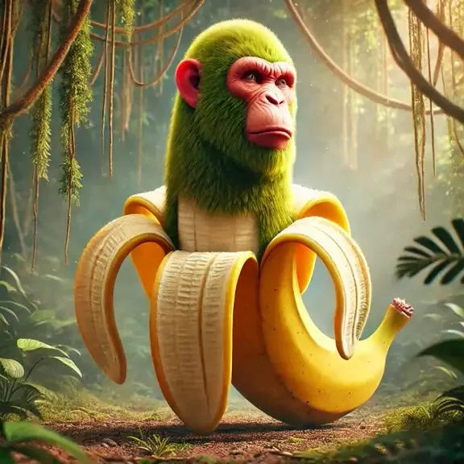</a><br><a href="characters/chimpanzini-bananini"><b>Chimpanzini Bananini</b></a><br><sub>🔊 </sub></td></tr>
<tr><td align="center" valign="top" width="33%"><a href="characters/cocofanto-elefanto"></a><br><a href="characters/cocofanto-elefanto"><b>Cocofanto Elefanto</b></a><br><sub>🔊 </sub></td><td align="center" valign="top" width="33%"><a href="characters/cocosino-rhino">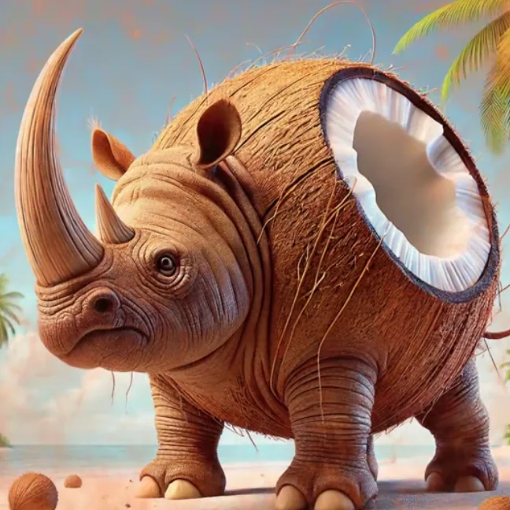</a><br><a href="characters/cocosino-rhino"><b>Cocosino Rhino</b></a><br><sub></sub></td><td align="center" valign="top" width="33%"><a href="characters/croco-potato">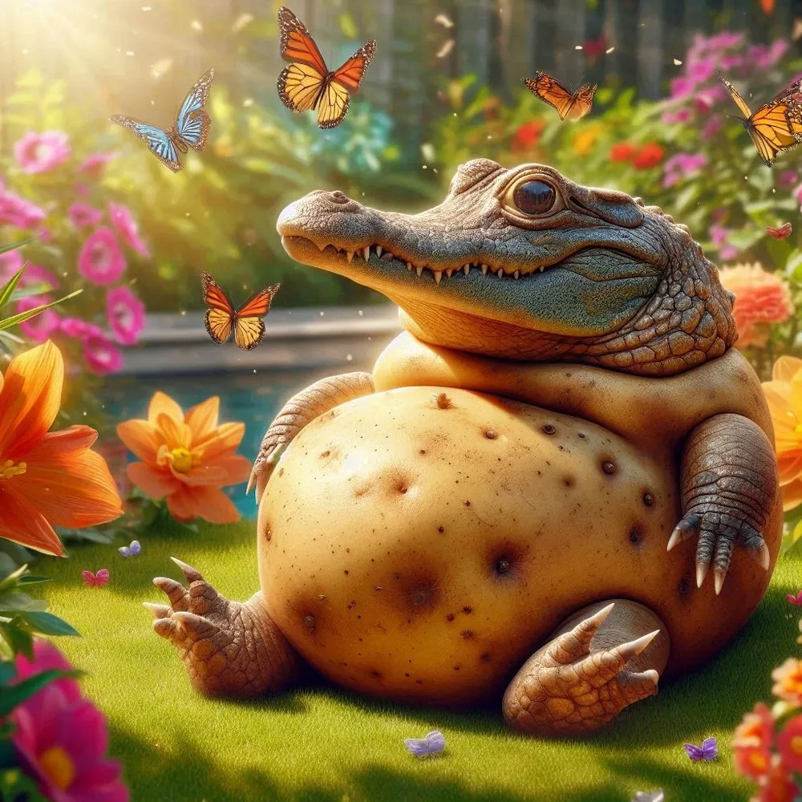</a><br><a href="characters/croco-potato"><b>Croco Potato</b></a><br><sub></sub></td></tr>
<tr><td align="center" valign="top" width="33%"><a href="characters/crocodillo-ananasinno">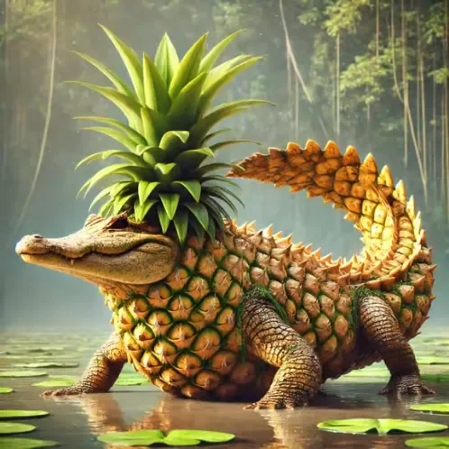</a><br><a href="characters/crocodillo-ananasinno"><b>Crocodillo Ananasinno</b></a><br><sub></sub></td></tr>
</table>

### E

<table>
<tr><td align="center" valign="top" width="33%"><a href="characters/ecco-cavallo-virtuoso">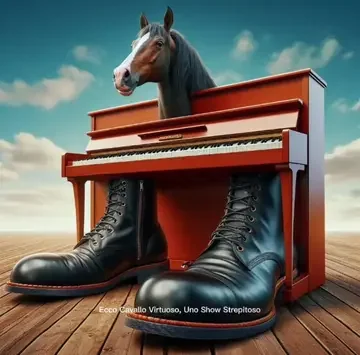</a><br><a href="characters/ecco-cavallo-virtuoso"><b>Ecco Cavallo Virtuoso</b></a><br><sub></sub></td><td align="center" valign="top" width="33%"><a href="characters/espressona-signora"></a><br><a href="characters/espressona-signora"><b>Espressona Signora</b></a><br><sub></sub></td></tr>
</table>

### F

<table>
<tr><td align="center" valign="top" width="33%"><a href="characters/frigo-camelo"></a><br><a href="characters/frigo-camelo"><b>Frigo Camelo</b></a><br><sub>🔊 </sub></td><td align="center" valign="top" width="33%"><a href="characters/frogilato-limituni">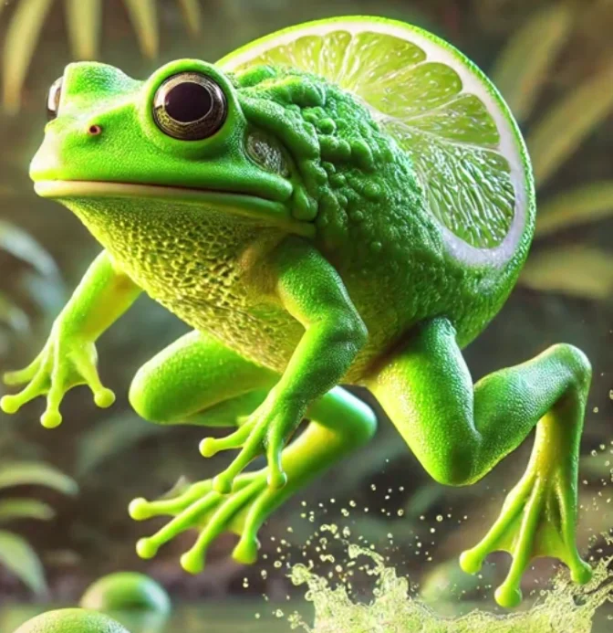</a><br><a href="characters/frogilato-limituni"><b>Frogilato Limituni</b></a><br><sub></sub></td><td align="center" valign="top" width="33%"><a href="characters/frulli-frulla">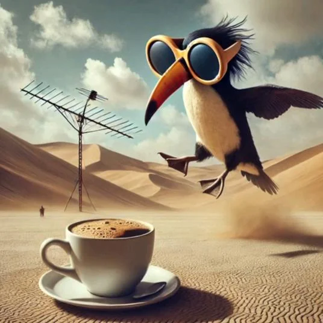</a><br><a href="characters/frulli-frulla"><b>Frulli Frulla</b></a><br><sub>🔊 </sub></td></tr>
</table>

### G

<table>
<tr><td align="center" valign="top" width="33%"><a href="characters/ganganzeli-trulala">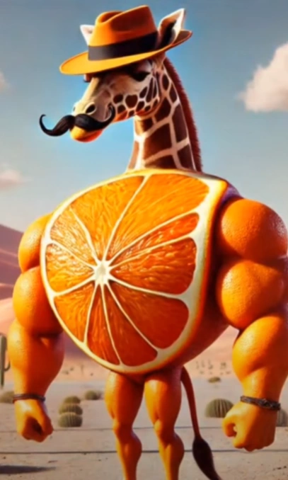</a><br><a href="characters/ganganzeli-trulala"><b>Ganganzeli Trulala</b></a><br><sub>🔊 </sub></td><td align="center" valign="top" width="33%"><a href="characters/garamararamararaman-dan-madudungdung-tak-tuntung-perkuntung"></a><br><a href="characters/garamararamararaman-dan-madudungdung-tak-tuntung-perkuntung"><b>Garamararamararaman Dan Madudungdung Tak Tuntung Perkuntung</b></a><br><sub></sub></td><td align="center" valign="top" width="33%"><a href="characters/girafa-celestre">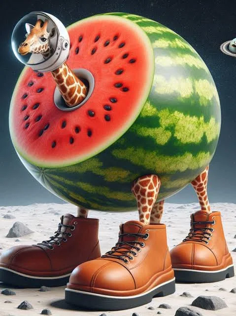</a><br><a href="characters/girafa-celestre"><b>Girafa Celestre</b></a><br><sub></sub></td></tr>
<tr><td align="center" valign="top" width="33%"><a href="characters/giraffa-meloniera">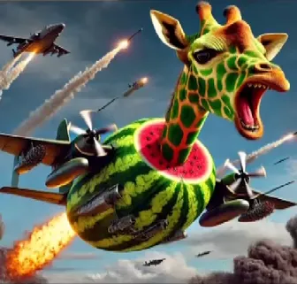</a><br><a href="characters/giraffa-meloniera"><b>Giraffa Meloniera</b></a><br><sub></sub></td><td align="center" valign="top" width="33%"><a href="characters/glorbo-fruttodrillo">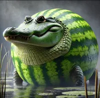</a><br><a href="characters/glorbo-fruttodrillo"><b>Glorbo Fruttodrillo</b></a><br><sub>🔊 </sub></td><td align="center" valign="top" width="33%"><a href="characters/gorillo-watermellondrillo">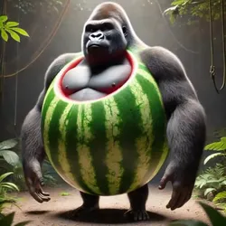</a><br><a href="characters/gorillo-watermellondrillo"><b>Gorillo Watermellondrillo</b></a><br><sub></sub></td></tr>
<tr><td align="center" valign="top" width="33%"><a href="characters/graipussi-medussi">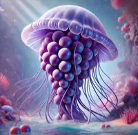</a><br><a href="characters/graipussi-medussi"><b>Graipussi Medussi</b></a><br><sub></sub></td></tr>
</table>

### I

<table>
<tr><td align="center" valign="top" width="33%"><a href="characters/il-cacto-hipopotamo"></a><br><a href="characters/il-cacto-hipopotamo"><b>Il Cacto Hipopotamo</b></a><br><sub>🔊 </sub></td></tr>
</table>

### L

<table>
<tr><td align="center" valign="top" width="33%"><a href="characters/la-vaca-saturno-saturnita"></a><br><a href="characters/la-vaca-saturno-saturnita"><b>La Vaca Saturno Saturnita</b></a><br><sub>🔊 </sub></td><td align="center" valign="top" width="33%"><a href="characters/lirili-larila"></a><br><a href="characters/lirili-larila"><b>Lirilì Larilà</b></a><br><sub>🔊 </sub></td></tr>
</table>

### M

<table>
<tr><td align="center" valign="top" width="33%"><a href="characters/malame-amarale">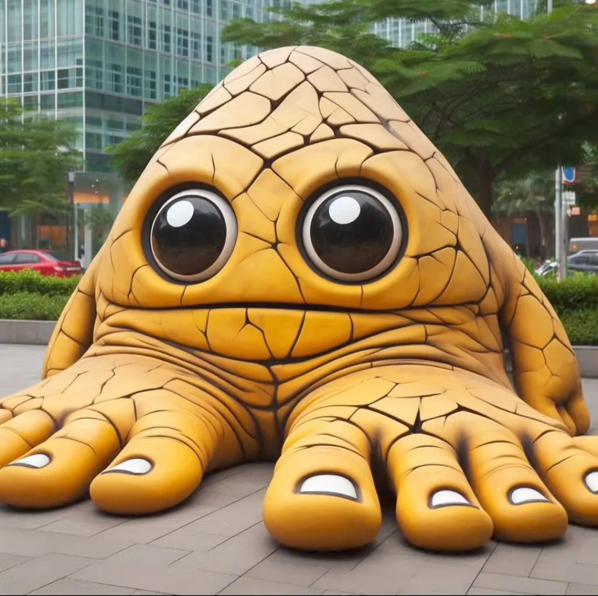</a><br><a href="characters/malame-amarale"><b>Malamé Amaralé</b></a><br><sub></sub></td><td align="center" valign="top" width="33%"><a href="characters/matteo-lavacanita"></a><br><a href="characters/matteo-lavacanita"><b>Matteo Lavacanita</b></a><br><sub></sub></td></tr>
</table>

### O

<table>
<tr><td align="center" valign="top" width="33%"><a href="characters/orangutini-ananasini"></a><br><a href="characters/orangutini-ananasini"><b>Orangutini Ananasini</b></a><br><sub>🔊 </sub></td></tr>
</table>

### P

<table>
<tr><td align="center" valign="top" width="33%"><a href="characters/pearuni-deeruni">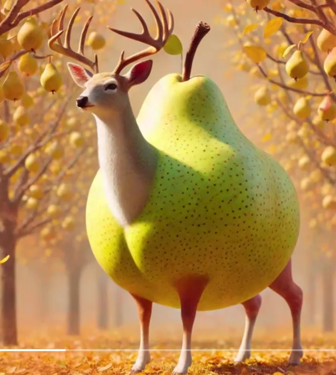</a><br><a href="characters/pearuni-deeruni"><b>Pearuni Deeruni</b></a><br><sub></sub></td><td align="center" valign="top" width="33%"><a href="characters/penguinelli-cactussini">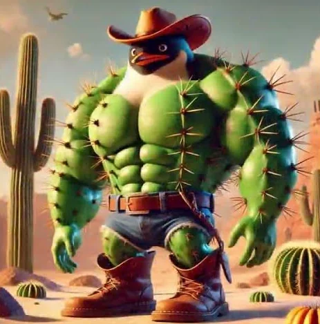</a><br><a href="characters/penguinelli-cactussini"><b>Penguinelli Cactussini</b></a><br><sub></sub></td><td align="center" valign="top" width="33%"><a href="characters/penguino-cocosino">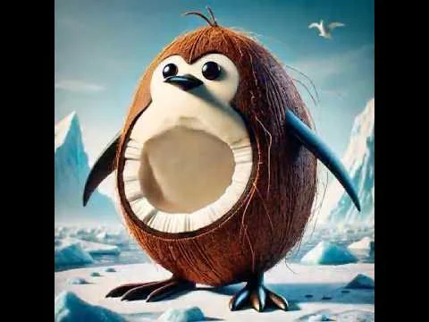</a><br><a href="characters/penguino-cocosino"><b>Penguino Cocosino</b></a><br><sub></sub></td></tr>
<tr><td align="center" valign="top" width="33%"><a href="characters/perochello-lemonchello"></a><br><a href="characters/perochello-lemonchello"><b>Perochello Lemonchello</b></a><br><sub></sub></td><td align="center" valign="top" width="33%"><a href="characters/piccione-macchina">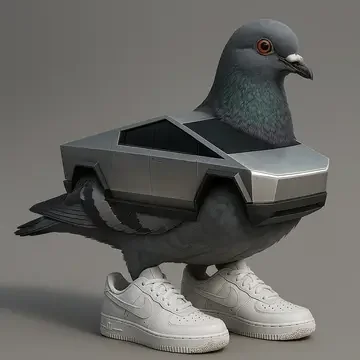</a><br><a href="characters/piccione-macchina"><b>Piccione Macchina</b></a><br><sub></sub></td><td align="center" valign="top" width="33%"><a href="characters/pippi-poppa-pippo-peppe">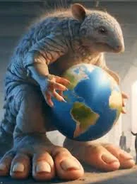</a><br><a href="characters/pippi-poppa-pippo-peppe"><b>Pippi Poppa Pippo Peppe</b></a><br><sub></sub></td></tr>
<tr><td align="center" valign="top" width="33%"><a href="characters/porco-elettronico"></a><br><a href="characters/porco-elettronico"><b>Porco Elettronico</b></a><br><sub></sub></td><td align="center" valign="top" width="33%"><a href="characters/pot-hotspot"></a><br><a href="characters/pot-hotspot"><b>Pot Hotspot</b></a><br><sub>🔊 </sub></td></tr>
</table>

### R

<table>
<tr><td align="center" valign="top" width="33%"><a href="characters/raccooni-watermelunni"></a><br><a href="characters/raccooni-watermelunni"><b>Raccooni Watermelunni</b></a><br><sub></sub></td><td align="center" valign="top" width="33%"><a href="characters/rhino-toasterino">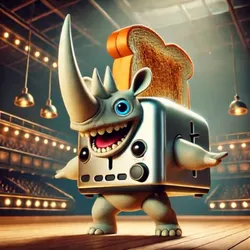</a><br><a href="characters/rhino-toasterino"><b>Rhino Toasterino</b></a><br><sub></sub></td></tr>
</table>

### S

<table>
<tr><td align="center" valign="top" width="33%"><a href="characters/slimo-li-appluni">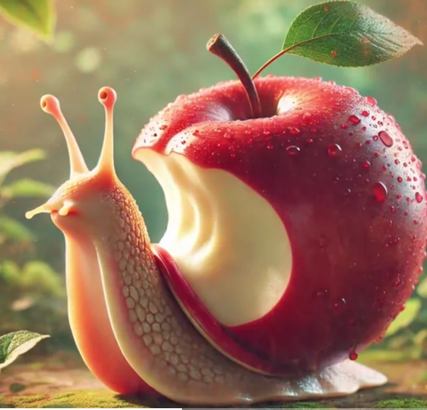</a><br><a href="characters/slimo-li-appluni"><b>Slimo Li Appluni</b></a><br><sub></sub></td><td align="center" valign="top" width="33%"><a href="characters/spaghetti-tualetti">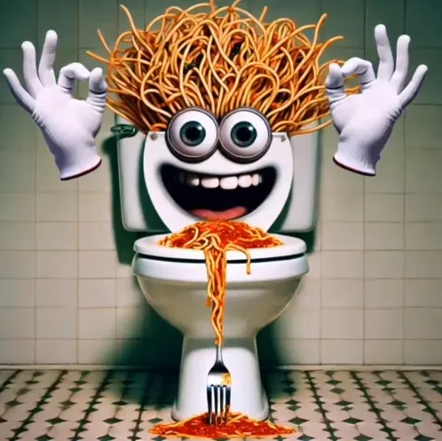</a><br><a href="characters/spaghetti-tualetti"><b>Spaghetti Tualetti</b></a><br><sub>🔊 </sub></td><td align="center" valign="top" width="33%"><a href="characters/spijuniro-golubiro"></a><br><a href="characters/spijuniro-golubiro"><b>Špijuniro Golubiro</b></a><br><sub>🔊 </sub></td></tr>
<tr><td align="center" valign="top" width="33%"><a href="characters/svinino-bombondino"></a><br><a href="characters/svinino-bombondino"><b>Svinino Bombondino</b></a><br><sub></sub></td></tr>
</table>

### T

<table>
<tr><td align="center" valign="top" width="33%"><a href="characters/ta-ta-ta-ta-ta-ta-ta-ta-ta-ta-ta-sahur">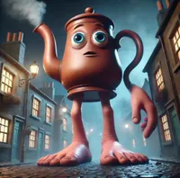</a><br><a href="characters/ta-ta-ta-ta-ta-ta-ta-ta-ta-ta-ta-sahur"><b>Ta Ta Ta Ta Ta Ta Ta Ta Ta Ta Ta Sahur</b></a><br><sub>🔊 </sub></td><td align="center" valign="top" width="33%"><a href="characters/tigroligre-frutonni"></a><br><a href="characters/tigroligre-frutonni"><b>Tigroligre Frutonni</b></a><br><sub></sub></td><td align="center" valign="top" width="33%"><a href="characters/tigrrullini-watermellini">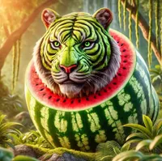</a><br><a href="characters/tigrrullini-watermellini"><b>Tigrrullini Watermellini</b></a><br><sub></sub></td></tr>
<tr><td align="center" valign="top" width="33%"><a href="characters/tracotucotulu-delapeladustuz">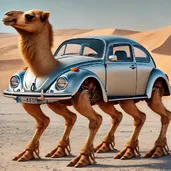</a><br><a href="characters/tracotucotulu-delapeladustuz"><b>Tracotucotulu Delapeladustuz</b></a><br><sub></sub></td><td align="center" valign="top" width="33%"><a href="characters/tralalero-tralala"></a><br><a href="characters/tralalero-tralala"><b>Tralalero Tralala</b></a><br><sub>🔊 </sub></td><td align="center" valign="top" width="33%"><a href="characters/tre-tigri-triste">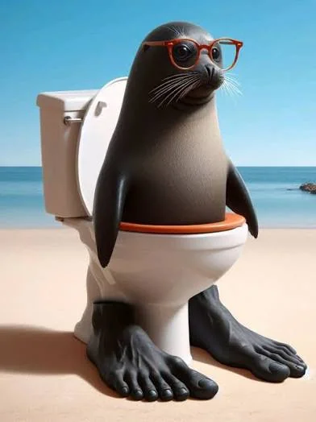</a><br><a href="characters/tre-tigri-triste"><b>Tre Tigri Triste</b></a><br><sub></sub></td></tr>
<tr><td align="center" valign="top" width="33%"><a href="characters/trenostruzzo-turbo-3000">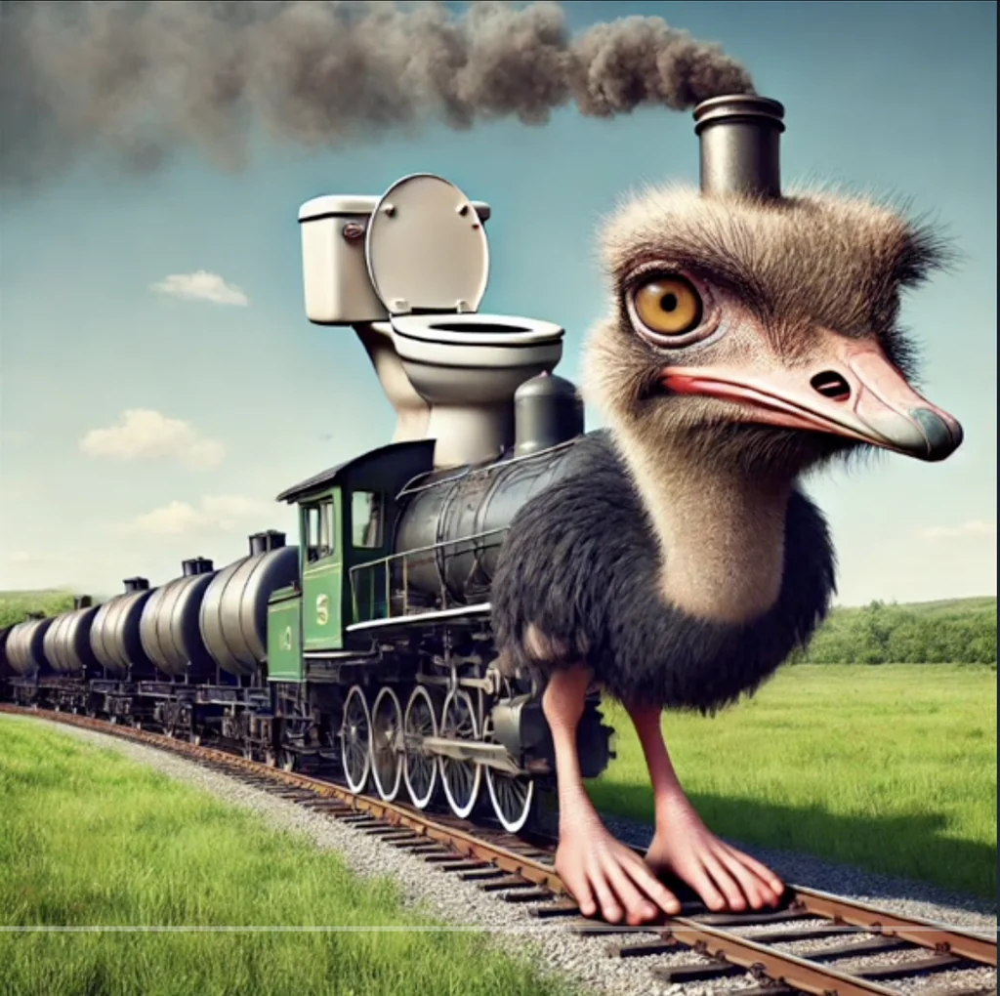</a><br><a href="characters/trenostruzzo-turbo-3000"><b>Trenostruzzo Turbo 3000</b></a><br><sub></sub></td><td align="center" valign="top" width="33%"><a href="characters/tric-trac-baraboom"></a><br><a href="characters/tric-trac-baraboom"><b>Tric Trac Baraboom</b></a><br><sub>🔊 </sub></td><td align="center" valign="top" width="33%"><a href="characters/trippa-troppa-crocodina">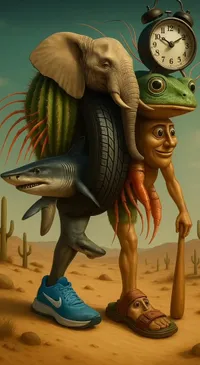</a><br><a href="characters/trippa-troppa-crocodina"><b>Trippa Troppa Tralala Lirilì Rilà Tung Sahur Boneca Tung Tralalelo Trippi Troppa Crocodina</b></a><br><sub>🔗 </sub></td></tr>
<tr><td align="center" valign="top" width="33%"><a href="characters/trippi-troppi"></a><br><a href="characters/trippi-troppi"><b>Trippi Troppi</b></a><br><sub>🔊 </sub></td><td align="center" valign="top" width="33%"><a href="characters/trullimero-trullicina">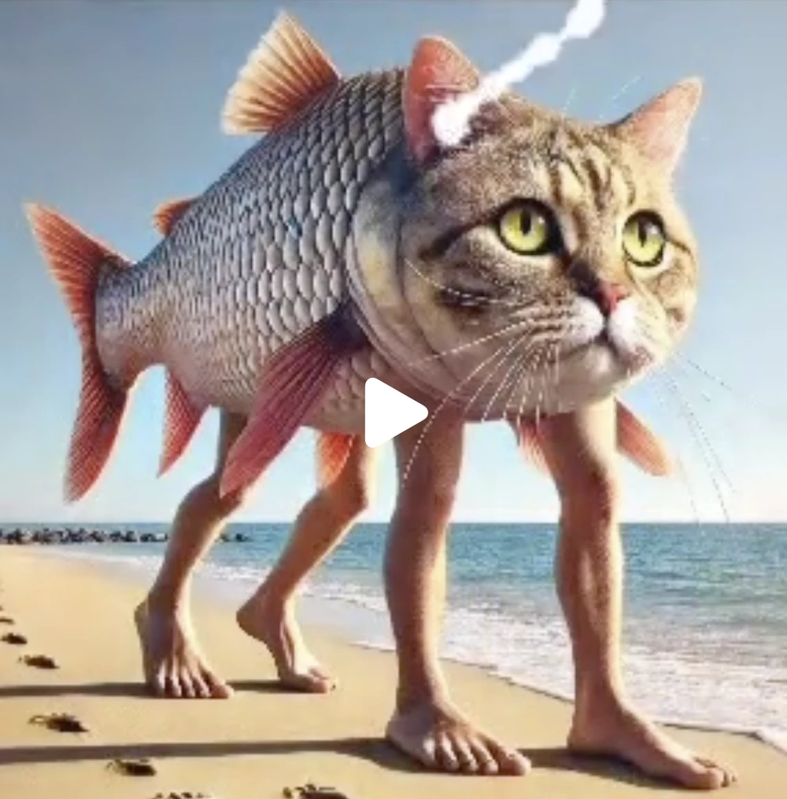</a><br><a href="characters/trullimero-trullicina"><b>Trullimero Trullicina</b></a><br><sub>🔊 </sub></td><td align="center" valign="top" width="33%"><a href="characters/tukanno-bananno">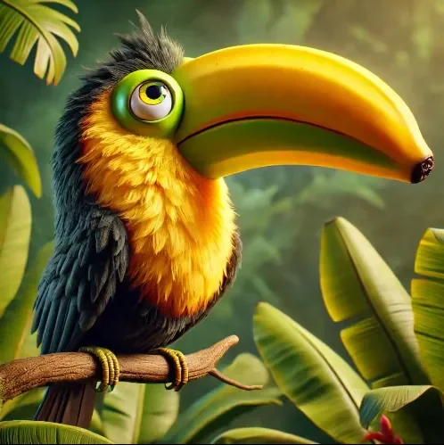</a><br><a href="characters/tukanno-bananno"><b>Tukanno Bananno</b></a><br><sub></sub></td></tr>
<tr><td align="center" valign="top" width="33%"><a href="characters/tung-tung-tung-sahur">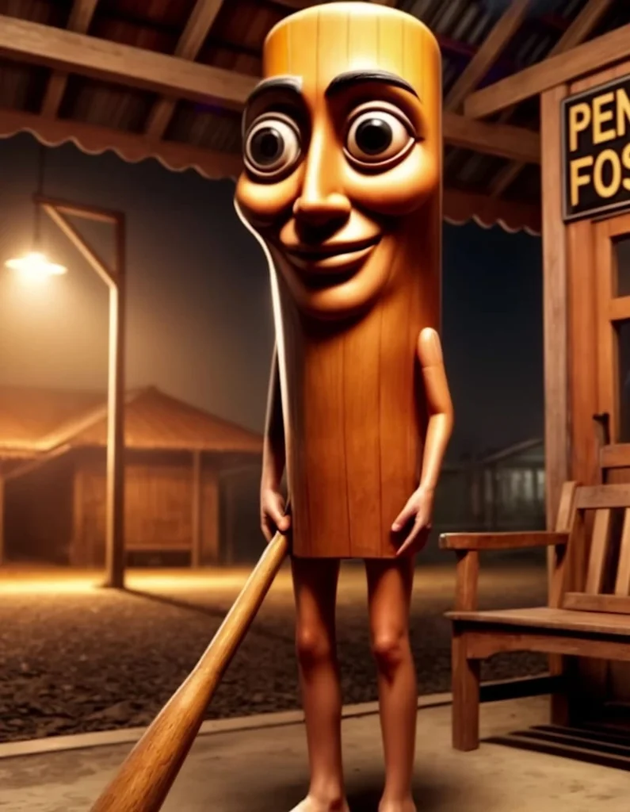</a><br><a href="characters/tung-tung-tung-sahur"><b>Tung Tung Tung Sahur</b></a><br><sub>🔊 </sub></td><td align="center" valign="top" width="33%"><a href="characters/tung-x9-assassino-boneca">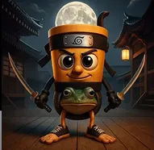</a><br><a href="characters/tung-x9-assassino-boneca"><b>Tung Tung Tung Tung Tung Tung Tung Tung Tung Assassino Boneca</b></a><br><sub></sub></td></tr>
</table>

### U

<table>
<tr><td align="center" valign="top" width="33%"><a href="characters/u-din-din-din-din-dun-ma-din-din-din-dun">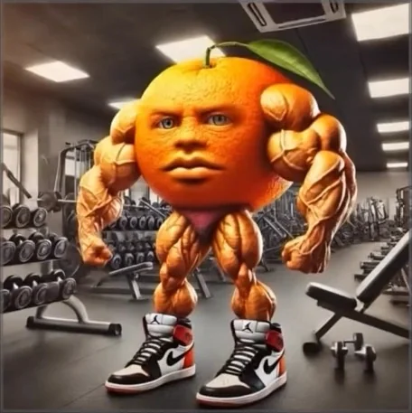</a><br><a href="characters/u-din-din-din-din-dun-ma-din-din-din-dun"><b>U Din Din Din Din Dun Ma Din Din Din Dun</b></a><br><sub>🔊 </sub></td></tr>
</table>

### Z

<table>
<tr><td align="center" valign="top" width="33%"><a href="characters/zibra-zubra-zibralini"></a><br><a href="characters/zibra-zubra-zibralini"><b>Zibra Zubra Zibralini</b></a><br><sub></sub></td></tr>
</table>

## Audio

Open or download an MP3:

- [Ballerina Cappuccina](characters/ballerina-cappuccina/ballerina-cappuccina.mp3)
- [Bobrini Cocococini](characters/bobrini-cocococini/bobrini-cocococini.mp3)
- [Bobrito Bandito](characters/bobrito-bandito/bobrito-bandito.mp3)
- [Bombardiro Crocodilo](characters/bombardiro-crocodilo/bombardiro-crocodilo.mp3)
- [Bombombini Gusini](characters/bombombini-gusini/bombombini-gusini.mp3)
- [Boneca Ambalabu](characters/boneca-ambalabu/boneca-ambalabu.mp3)
- [Brr Brr Patapim](characters/brr-brr-patapim/brr-brr-patapim.mp3)
- [Brri Brri Bicus Dicus Bombicus](characters/brri-brri-bicus-dicus-bombicus/brri-brri-bicus-dicus-bombicus.mp3)
- [Bulbito Bandito Traktorito](characters/bulbito-bandito-traktorito/bulbito-bandito-traktorito.mp3)
- [Burbaloni Luliloli](characters/burbaloni-luliloli/burbaloni-luliloli.mp3)
- [Cappuccino Assassino](characters/cappuccino-assassino/cappuccino-assassino.mp3)
- [Chimpanzini Bananini](characters/chimpanzini-bananini/chimpanzini-bananini.mp3)
- [Cocofanto Elefanto](characters/cocofanto-elefanto/cocofanto-elefanto.mp3)
- [Frigo Camelo](characters/frigo-camelo/frigo-camelo.mp3)
- [Frulli Frulla](characters/frulli-frulla/frulli-frulla.mp3)
- [Ganganzeli Trulala](characters/ganganzeli-trulala/ganganzeli-trulala.mp3)
- [Glorbo Fruttodrillo](characters/glorbo-fruttodrillo/glorbo-fruttodrillo.mp3)
- [Il Cacto Hipopotamo](characters/il-cacto-hipopotamo/il-cacto-hipopotamo.mp3)
- [La Vaca Saturno Saturnita](characters/la-vaca-saturno-saturnita/la-vaca-saturno-saturnita.mp3)
- [Lirilì Larilà](characters/lirili-larila/lirili-larila.mp3)
- [Orangutini Ananasini](characters/orangutini-ananasini/orangutini-ananasini.mp3)
- [Pot Hotspot](characters/pot-hotspot/pot-hotspot.mp3)
- [Spaghetti Tualetti](characters/spaghetti-tualetti/spaghetti-tualetti.mp3)
- [Špijuniro Golubiro](characters/spijuniro-golubiro/spijuniro-golubiro.mp3)
- [Ta Ta Ta Ta Ta Ta Ta Ta Ta Ta Ta Sahur](characters/ta-ta-ta-ta-ta-ta-ta-ta-ta-ta-ta-sahur/ta-ta-ta-ta-ta-ta-ta-ta-ta-ta-ta-sahur.mp3)
- [Tralalero Tralala](characters/tralalero-tralala/tralalero-tralala.mp3)
- [Tric Trac Baraboom](characters/tric-trac-baraboom/tric-trac-baraboom.mp3)
- [Trippi Troppi](characters/trippi-troppi/trippi-troppi.mp3)
- [Trullimero Trullicina](characters/trullimero-trullicina/trullimero-trullicina.mp3)
- [Tung Tung Tung Sahur](characters/tung-tung-tung-sahur/tung-tung-tung-sahur.mp3)
- [U Din Din Din Din Dun Ma Din Din Din Dun](characters/u-din-din-din-din-dun-ma-din-din-din-dun/u-din-din-din-din-dun-ma-din-din-din-dun.mp3)

## Other spellings

Use Ctrl+F to find a name or alias.

| Character | Also spelled |
|-----------|--------------|
| [Ballerina Cappuccina](characters/ballerina-cappuccina) | ballerina cappucina |
| [Bluberini Octopusini](characters/bluberini-octopusini) | blueberrinni octopussini |
| [Bombardiro Crocodilo](characters/bombardiro-crocodilo) | bombardino crocodilo |
| [Bombombini Gusini](characters/bombombini-gusini) | bobombini goosini, bombini gusini |
| [Burbaloni Luliloli](characters/burbaloni-luliloli) | burbaloni lulilolli |
| [Cappuccino Assassino](characters/cappuccino-assassino) | capuccino assasino |
| [Espressona Signora](characters/espressona-signora) | espressona señora |
| [Frigo Camelo](characters/frigo-camelo) | frigo camello buffo fardello |
| [Ganganzeli Trulala](characters/ganganzeli-trulala) | ganganzelli trulala |
| [Girafa Celestre](characters/girafa-celestre) | giraffa celeste |
| [La Vaca Saturno Saturnita](characters/la-vaca-saturno-saturnita) | la vacca saturno saturnita |
| [Penguinelli Cactussini](characters/penguinelli-cactussini) | lerulerulerule |
| [Pippi Poppa Pippo Peppe](characters/pippi-poppa-pippo-peppe) | pipi popa pipo pepe |
| [Porco Elettronico](characters/porco-elettronico) | porco eletronico |
| [Pot Hotspot](characters/pot-hotspot) | hotspot bro |
| [Slimo Li Appluni](characters/slimo-li-appluni) | slimi appluni |
| [Trippa Troppa Tralala Lirilì Rilà Tung Sahur Boneca Tung Tralalelo Trippi Troppa Crocodina](characters/trippa-troppa-crocodina) | trippa troppa tralala lirilì rilà tung tung sahur boneca tung tung tralalelo trippi troppa crocodina |
| [Trullimero Trullicina](characters/trullimero-trullicina) | trulimero trulicina, trulimero trulichina |
| [Tung Tung Tung Sahur](characters/tung-tung-tung-sahur) | tung tung tung tung tung tung tung tung tung sahur, triple t |

## Download

- [Download ZIP](https://github.com/balaboom123/awesome-italian-brainrot/archive/refs/heads/main.zip) or open a character page for individual files.
- Large originals are linked from each character page.
- [characters.json](characters.json) contains the full index.

For a smaller clone, skip the older file history:

```sh
git clone --depth 1 https://github.com/balaboom123/awesome-italian-brainrot.git
```

## Contributing

[Suggest a character](https://github.com/balaboom123/awesome-italian-brainrot/issues/new?template=add-character.yml) or [add audio](https://github.com/balaboom123/awesome-italian-brainrot/issues/new?template=add-audio.yml).

For pull requests, add the files and metadata, then run `python3 scripts/build_readme.py`.
See [CONTRIBUTING.md](CONTRIBUTING.md) for naming and file limits.

## License

The index, READMEs and scripts use [CC0](LICENSE). Images and audio retain their original rights; this repo grants no media license. Source links appear on each character page. Wiki text licenses do not automatically cover media. Rights holders may request removal.
