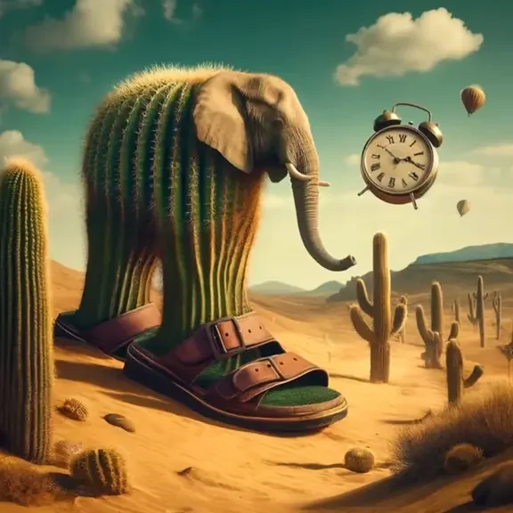

<!-- Generated by scripts/build_readme.py; edit characters.json and regenerate. -->

# Lirilì Larilà

## Downloads

- [Audio (MP3)](lirili-larila.mp3) · [source](https://www.myinstants.com/en/instant/lirili-larila-26737/) · MyInstants uploader: ovesomeone21 · Unknown media license
- [Thumbnail · Namu Wiki](lirili-larila_namuwiki.webp)
- [Thumbnail · Wikimedia Commons](lirili-larila_commons.webp)
- [Full image · Namu Wiki · 1000x1012](lirili-larila_namuwiki_full.png)
- [Full image · Wikimedia Commons · 576x576](https://upload.wikimedia.org/wikipedia/commons/7/7f/Liril%C3%AC_Laril%C3%A0.webp?utm_source=commons.wikimedia.org&utm_campaign=imageinfo&utm_content=original)

## Sources

- [Namu Wiki](https://en.namu.wiki/w/Italian%20Brainrot/%EB%93%B1%EC%9E%A5%20%EC%BA%90%EB%A6%AD%ED%84%B0)
- [Wikimedia Commons](https://commons.wikimedia.org/wiki/File:Liril%C3%AC_Laril%C3%A0.webp) · Unknown (TikTok anonymous users) · Public domain

[← All characters](../../README.md)
